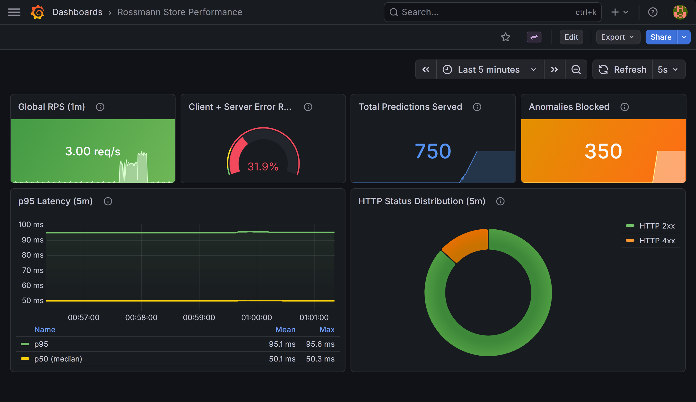
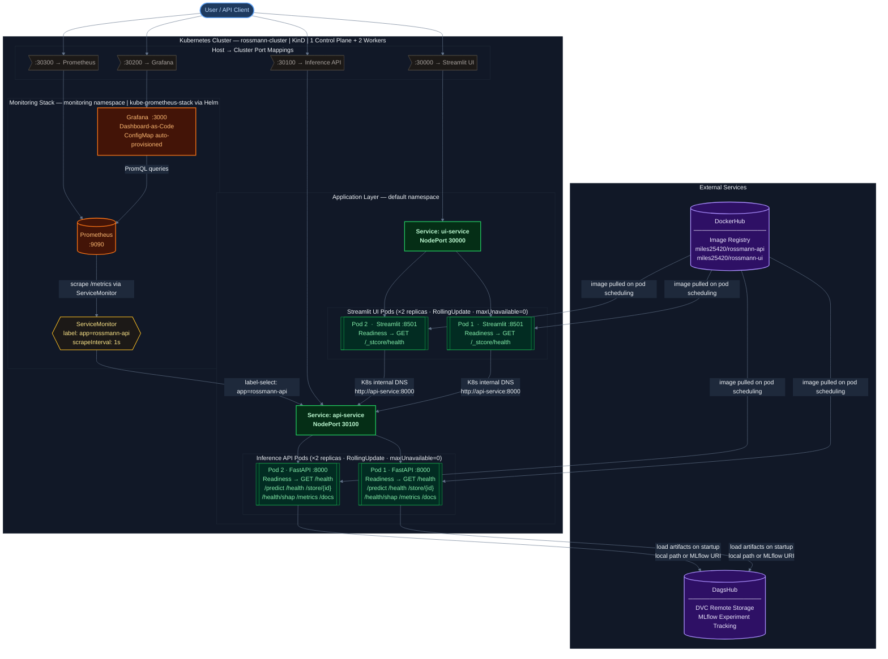
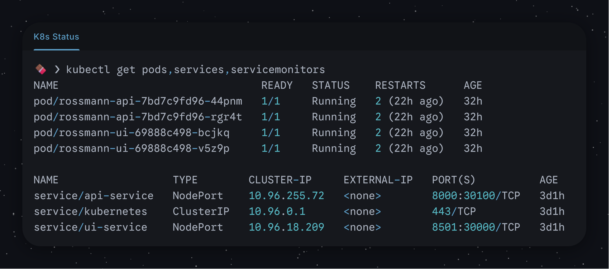
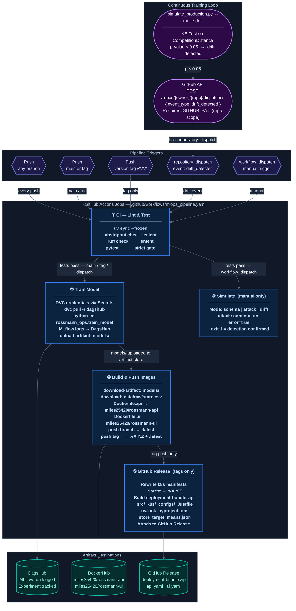
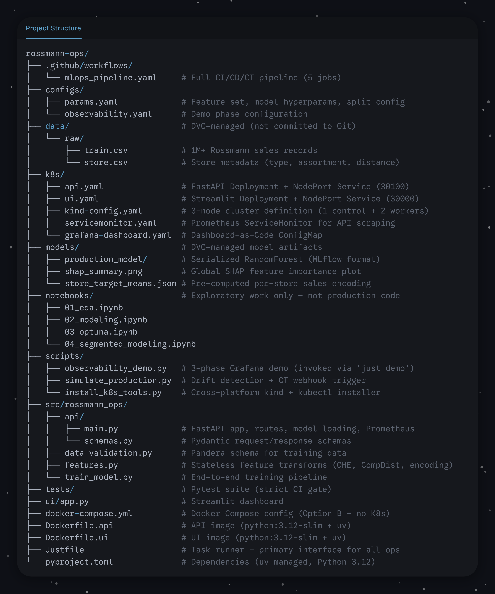

<div align="center">
    
# Rossmann Store Sales Demand Forecasting (MLOps Pipeline)

[](https://python.org)
[](LICENSE)
[](https://github.com/miles2542/rossmann-ops/actions/workflows/mlops_pipeline.yaml)
[](https://github.com/miles2542/rossmann-ops/tree/main/tests)

[](https://dvc.org)
[](https://mlflow.org)
[](https://docker.com)
[](https://kubernetes.io)



*Predicts daily store sales for 1,115 Rossmann stores using a Random Forest model trained on 2+ years of transactional data. Deployed as a multi-replica microservice on a local Kubernetes cluster, with end-to-end automation covering CI, CD, and CT.*

</div>

---

## System Highlights

| Capability              | Implementation                                                                                                                    |
| :---------------------- | :-------------------------------------------------------------------------------------------------------------------------------- |
| **Serving**             | FastAPI + 2-replica K8s deployment with `RollingUpdate` zero-downtime strategy                                                    |
| **Security**            | Layered defense: Pandera schema validation → Pydantic bounds → CompetitionDistance guard                                          |
| **Telemetry**           | Prometheus custom metrics (`sales_inference_total`, `inference_anomalies_blocked`) scraped at 1s intervals, visualized in Grafana |
| **Explainability**      | SHAP feature importance served via API, rendered live in the Streamlit dashboard                                                  |
| **Reproducibility**     | `uv.lock` + DVC-pinned artifacts; `just setup` installs everything deterministically                                              |
| **Continuous Training** | KS-Test drift detection triggers `repository_dispatch` → auto-retrain pipeline                                                    |

---

## Architecture

### Diagram 1 — Deployment Topology



### Active Cluster State



### Diagram 2 — Automated Pipeline  (CI / CD / CT)



---

## Getting Started

```bash
git clone https://github.com/miles2542/rossmann-ops.git
cd rossmann-ops
```

---

## Prerequisites

This project uses [`just`](https://github.com/casey/just) as its unified task runner and [`uv`](https://docs.astral.sh/uv/) for Python dependency management. Install **only these two tools** manually — `just setup` / `just deploy-all` handle everything else automatically (`.venv` creation, dependency install, DVC pull, model training, Docker builds, K8s deploy).

### Step 0 — Install `just`

`just` is a lightweight, cross-platform command runner. Install it system-wide, then **restart your shell or reopen VS Code** before continuing.

| Platform             | Command                                                                                                |
| :------------------- | :----------------------------------------------------------------------------------------------------- |
| **Windows** (winget) | `winget install --id Casey.Just`                                                                       |
| **macOS** (Homebrew) | `brew install just`                                                                                    |
| **Linux**            | `curl --proto '=https' --tlsv1.2 -sSf https://just.systems/install.sh \| bash -s -- --to ~/.local/bin` |

### Step 1 — Install `uv`

`uv` is a fast Python package and environment manager. Install it **into your system Python** (not inside a project venv) so it is available as a global command:

```bash
pip install uv

# Or via the official installer:
# Windows (PowerShell):  powershell -c "irm https://astral.sh/uv/install.ps1 | iex"
# macOS / Linux:         curl -LsSf https://astral.sh/uv/install.sh | sh
```

> Once `uv` is installed globally, `just setup` will automatically create the project `.venv` and install all Python dependencies. No manual `pip install` or `venv` commands needed.

### Step 2 — Install Docker Desktop and Helm

Required for Docker Compose (Option B) and K8s deployment (Option C). Not needed for local-only development (Option A).

| Tool               | Installation                                                                          |
| :----------------- | :------------------------------------------------------------------------------------ |
| **Docker Desktop** | [docker.com/products/docker-desktop](https://www.docker.com/products/docker-desktop/) |
| **Helm**           | [helm.sh/docs/intro/install](https://helm.sh/docs/intro/install/)                     |

### Step 3 — Install `kind` and `kubectl` (K8s path only)

```bash
just install-k8s-tools
```

Detects your OS and uses `winget` (Windows), `brew` (macOS), or downloads official binaries (Linux). Restart your shell after completion.

### Required Credentials

Copy `.env.example` → `.env` and populate:

```bash
# DagsHub — remote DVC storage + MLflow tracking
# Repository: https://dagshub.com/miles2542/rossmann-ops
DAGSHUB_USERNAME=miles2542
DAGSHUB_PAT=<personal-access-token>

# MLflow remote tracking server (points to DagsHub)
MLFLOW_TRACKING_URI=https://dagshub.com/miles2542/rossmann-ops.mlflow
MLFLOW_TRACKING_USERNAME=miles2542
MLFLOW_TRACKING_PASSWORD=<personal-access-token>
```

> [!NOTE]
> **GitHub Actions CI/CD Secrets:** In repository Settings → Secrets and Variables → Actions, configure:
> `DAGSHUB_USERNAME`, `DAGSHUB_PAT`, `DOCKERHUB_USERNAME` (`miles25420`), `DOCKERHUB_TOKEN`, and optionally `GITHUB_PAT` (needed for the CT retraining webhook from a local machine).

> **DockerHub credentials** are only needed as GitHub Actions secrets for the CD stage — not for local deployments.

---

## Quickstart

> [!NOTE]
> Recommend **option C** for full testing (e.g. for professor)

<details>
<summary><strong>Option A — Local Development</strong> (no Docker, no K8s — fastest path)</summary>

```bash
# 1. Install deps and pull DVC-tracked data artifacts
just setup

# 2. Train the production model (logs to MLflow, ~5-10 min)
just train-prod

# 3. Start the inference API (terminal 1) and dashboard (terminal 2)
just serve-api     # FastAPI   ->  http://localhost:8000/docs
just serve-ui      # Streamlit ->  http://localhost:8501

# 4. (Optional) Inspect experiment runs in the MLflow UI
just mlflow-ui     # ->  http://localhost:5000
```

</details>

<details>
<summary><strong>Option B — Docker Compose</strong> (no K8s required)</summary>

Pulls the published images from DockerHub and runs them with a single command. Requires **Docker Desktop only** — no `kind`, `kubectl`, or `helm` needed.

```bash
just docker-up     # pull latest images and start (detached)
just docker-down   # stop and remove containers
```

| Service      | URL                             |
| :----------- | :------------------------------ |
| Streamlit UI | `http://localhost:30000`        |
| API Docs     | `http://localhost:30100/docs`   |
| API Health   | `http://localhost:30100/health` |

> [!NOTE]
> This path uses the latest published image from DockerHub (`miles25420/rossmann-api:latest`). Prometheus/Grafana monitoring is **not** included. For the full observability stack, use Option C.

</details>

<details>
<summary><strong>Option C — Full K8s Production Deployment</strong> ✦ Recommended for graders</summary>

Trains the model locally, builds Docker images, deploys to a local KinD cluster, and provisions Prometheus + Grafana monitoring. Requires Steps 0–3 of Prerequisites.

```bash
just deploy-all
```

> Estimated runtime: 10–20 minutes on a modern machine (mainly due to Docker build and loading image into KinD).

Once running, all services are available at `localhost`:

| Service      | URL                             | Credentials               |
| :----------- | :------------------------------ | :------------------------ |
| Streamlit UI | `http://localhost:30000`        | —                         |
| API Docs     | `http://localhost:30100/docs`   | —                         |
| API Health   | `http://localhost:30100/health` | —                         |
| Grafana      | `http://localhost:30200`        | `admin` / `prom-operator` |
| Prometheus   | `http://localhost:30300`        | —                         |

</details>

### Useful Maintenance Commands

```bash
just k8s-status     # Show all pods + services across namespaces
just k8s-down       # Delete the KinD cluster
just k8s-update     # Rebuild images + rolling restart deployments
just lint           # Run Ruff linter, can add --fix to auto-fix
just format         # Auto-format code (Ruff)
just test           # Run full pytest suite with coverage
```

---

## Running Observability Demos

With the K8s stack or Docker Compose running:

```bash
just demo
```

Sends 3 sequential traffic phases — normal predictions, malformed schema requests (422s), and data-poisoned payloads (`CompetitionDistance > 100,000m`) — to create visible spikes in the Grafana dashboard at `http://localhost:30200`.


---

## Repository Structure



---

## Extra Documentation

| Document                                                       | Description                                                          |
| :------------------------------------------------------------- | :------------------------------------------------------------------- |
| [ML Pipeline](docs/ML_PIPELINE.md)                             | Feature engineering, modeling strategy, metrics, SHAP explainability |
| [MLOps Architecture](docs/MLOPS_ARCHITECTURE.md)               | K8s topology, deployment strategy, CI/CD/CT flow                     |
| [Observability & Security](docs/OBSERVABILITY_AND_SECURITY.md) | Defensive layers, telemetry, drift detection, Grafana dashboard      |

---

## License

Apache License 2.0. See [LICENSE](LICENSE) for full terms.
