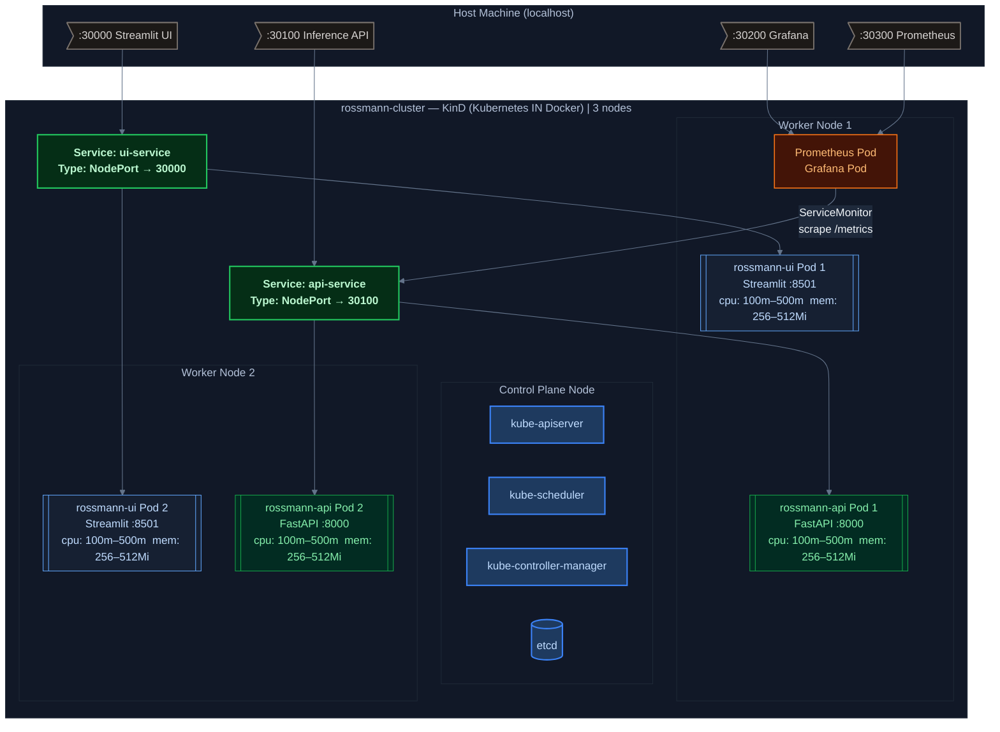
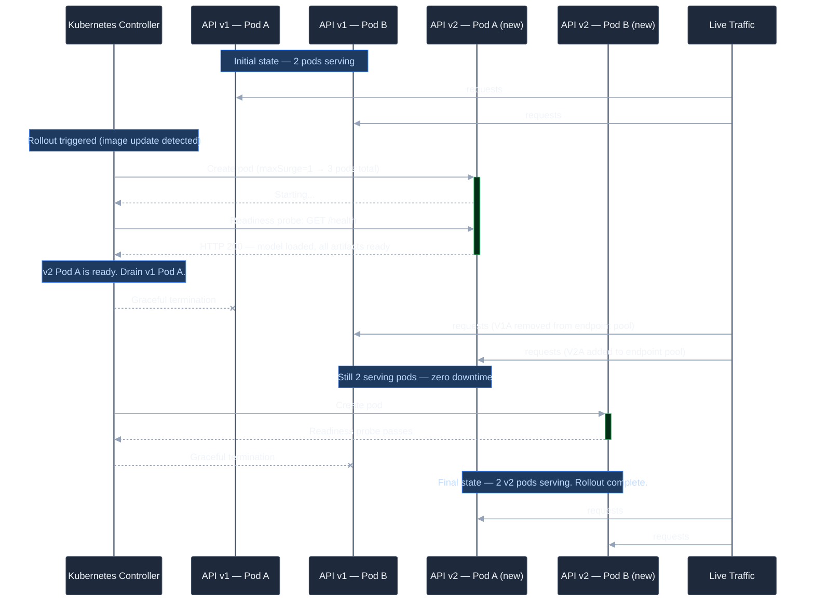
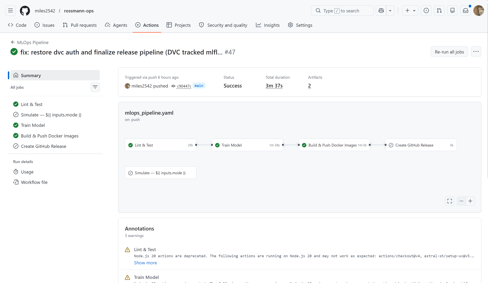
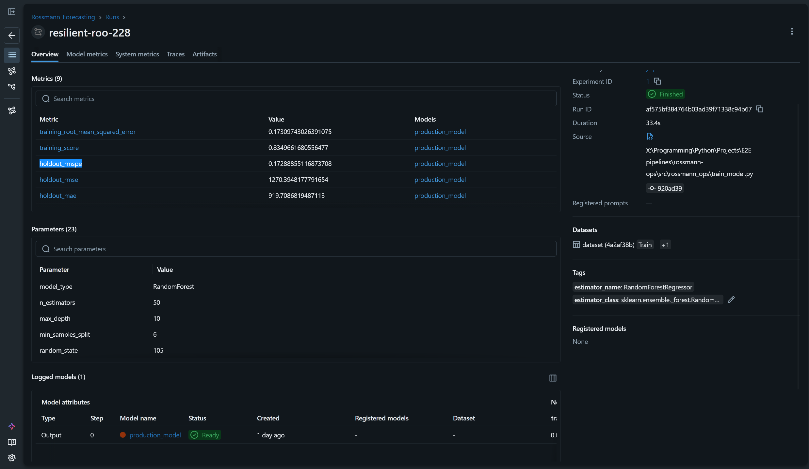
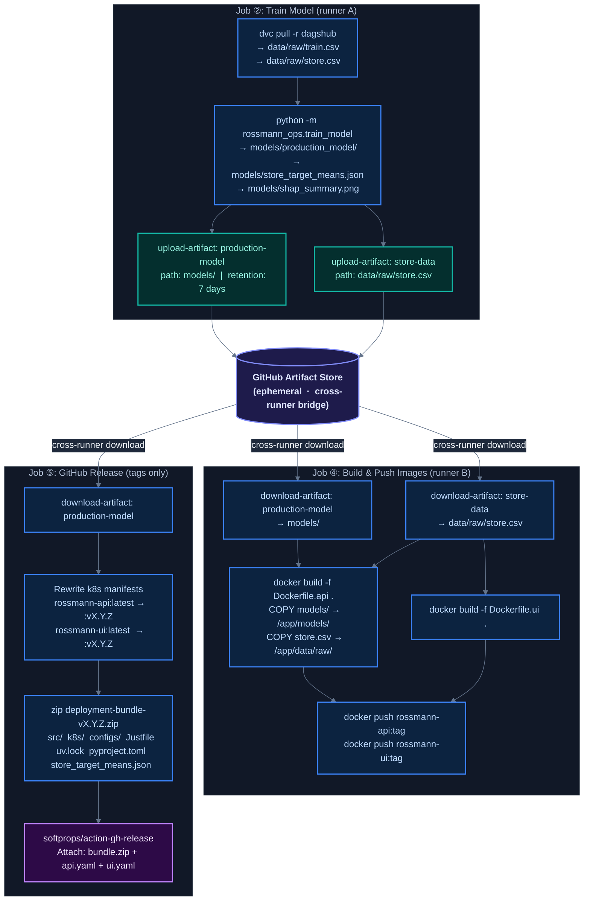

# MLOps Architecture

**Infrastructure topology, deployment strategy, and automated pipeline design.**

---

## Table of Contents

1. [Kubernetes Cluster Topology](#1-kubernetes-cluster-topology)
2. [Application Deployments](#2-application-deployments)
3. [Deployment Strategy — RollingUpdate](#3-deployment-strategy--rollingupdate)
4. [Health Checks & Readiness Gates](#4-health-checks--readiness-gates)
5. [Monitoring Stack](#5-monitoring-stack)
6. [CI/CD/CT Pipeline](#6-cicdct-pipeline)
7. [Docker Image Strategy](#7-docker-image-strategy)
8. [Artifact Bridging Between Jobs](#8-artifact-bridging-between-jobs)

---

## 1. Kubernetes Cluster Topology

**Implementation**: `k8s/kind-config.yaml`

The local cluster is provisioned using **kind (Kubernetes IN Docker)** v0.31.0 — a single-host Kubernetes environment that runs nodes as Docker containers.

### Cluster Definition

```yaml
# k8s/kind-config.yaml
apiVersion: kind.x-k8s.io/v1alpha4
kind: Cluster
name: rossmann-cluster
nodes:
  - role: control-plane
    extraPortMappings:
      - containerPort: 30000    # Streamlit UI
        hostPort: 30000
      - containerPort: 30100    # FastAPI Inference API
        hostPort: 30100
      - containerPort: 30200    # Grafana Dashboard
        hostPort: 30200
      - containerPort: 30300    # Prometheus UI
        hostPort: 30300
  - role: worker
  - role: worker
```

**NodePort mappings** forward `localhost:{hostPort}` directly to the cluster's transport layer — no additional ingress controller is required for local operation.

### Cluster Topology



### Active Cluster State


---

## 2. Application Deployments

Both application deployments share the same structural template: `apps/v1` Deployment + `v1` NodePort Service, defined in a single YAML file each.

### FastAPI Inference API (`k8s/api.yaml`)

```yaml
spec:
  replicas: 2
  strategy:
    type: RollingUpdate
    rollingUpdate:
      maxSurge: 1          # 1 extra pod created during update
      maxUnavailable: 0    # no pod taken down before replacement is ready

  containers:
    - name: rossmann-api
      image: rossmann-api:latest    # rewritten to DockerHub tag on release
      ports:
        - containerPort: 8000
      resources:
        requests:
          cpu: "100m"
          memory: "256Mi"
        limits:
          cpu: "500m"
          memory: "512Mi"
```

**Service**:
- Type: `NodePort`
- `port: 8000` → `targetPort: 8000` → `nodePort: 30100`

### Streamlit UI (`k8s/ui.yaml`)

```yaml
spec:
  replicas: 2
  strategy:
    type: RollingUpdate
    rollingUpdate:
      maxSurge: 1
      maxUnavailable: 0

  containers:
    - name: rossmann-ui
      image: rossmann-ui:latest
      ports:
        - containerPort: 8501
      env:
        - name: API_URL
          value: "http://api-service:8000"   # K8s internal DNS — stable across pod restarts
      resources:
        requests:
          cpu: "100m"
          memory: "256Mi"
        limits:
          cpu: "500m"
          memory: "512Mi"
```

**Service**:
- Type: `NodePort`
- `port: 8501` → `targetPort: 8501` → `nodePort: 30000`

**UI-to-API communication**: Uses Kubernetes internal DNS `http://api-service:8000` rather than `localhost` or `NodePort`. This resolves correctly within the cluster regardless of which node the UI pod is scheduled on, and avoids the extra network hop through the host machine.

---

## 3. Deployment Strategy — RollingUpdate

Both deployments explicitly define `strategy: type: RollingUpdate` (`k8s/api.yaml`, line 11; `k8s/ui.yaml`, line 11).

### Why RollingUpdate?

| Strategy | Behavior | Downtime | Use Case |
| :--- | :--- | :--- | :--- |
| **RollingUpdate** | Incrementally replaces old pods with new ones | **Zero** | Stateless services where any replica can serve any request |
| `Recreate` | Terminates all old pods, then starts new ones | **Full** | Stateful services requiring exclusive resource access (e.g., database migrations) |

This system's inference API is **fully stateless** — each pod loads the same model artifact independently. Any replica can handle any request without coordination. `RollingUpdate` is therefore the correct and safe strategy.

### Rolling Update Sequence

With `replicas: 2`, `maxSurge: 1`, `maxUnavailable: 0`:



At no point during this sequence does the number of serving pods drop below 2 (`maxUnavailable: 0`). Live traffic continues without interruption.

---

## 4. Health Checks & Readiness Gates

Two distinct probe types are configured per deployment, targeting different API endpoints.

### FastAPI Probes

| Probe | Endpoint | Delay | Period | Behaviour |
| :--- | :--- | :--- | :--- | :--- |
| **Readiness** | `GET /health` | 15s | 10s | Returns `200` only if model + store data + target means are all loaded. K8s routes traffic to this pod only when ready. |
| **Liveness** | `GET /health/live` | 20s | 20s | Returns `200` always (process is alive). K8s restarts pod if this fails. |

**Readiness probe logic** (`api/main.py`, lines 142–160):
```python
@app.get("/health")
def readiness_check(response: Response):
    is_ready = MODEL is not None and STORE_DF is not None and STORE_MEANS is not None
    if not is_ready:
        response.status_code = 503
    return {
        "status": "healthy" if is_ready else "degraded",
        "model_loaded": MODEL is not None,
        "store_data_loaded": STORE_DF is not None,
        "store_means_loaded": STORE_MEANS is not None,
        "model_version": MODEL_VERSION,
        "environment": os.getenv("ENV", "development"),
    }
```

This is an **"honest" readiness check** — it verifies that the actual inference prerequisites are loaded, not just that the HTTP server is accepting connections. A pod that is alive but missing its model artifact will receive `503` and be excluded from the Service's endpoint pool until artifacts load successfully.

**Liveness probe logic** (`api/main.py`, lines 136–139):
```python
@app.get("/health/live")
def liveness_check():
    return {"status": "alive"}
```

The liveness probe is deliberately minimal — only the process crash case should trigger a pod restart. A model loading failure is a readiness concern, not a liveness concern.

### Streamlit Probes

Both readiness and liveness probes target Streamlit's built-in health endpoint:
```
GET /_stcore/health   (port 8501)
initialDelaySeconds: 10 (readiness) / 20 (liveness)
periodSeconds: 10 (readiness) / 20 (liveness)
```

---

## 5. Monitoring Stack

**Installation**: `kube-prometheus-stack` Helm chart (Prometheus Community).

**Recipe** (`Justfile`, lines 72–83):
```bash
helm upgrade --install prom -n monitoring --create-namespace \
    prometheus-community/kube-prometheus-stack \
    --set grafana.service.type=NodePort \
    --set grafana.service.nodePort=30200 \
    --set grafana.adminPassword=prom-operator \
    --set prometheus.prometheusSpec.serviceMonitorSelectorNilUsesHelmValues=false \
    --set prometheus.prometheusSpec.scrapeInterval=1s \
    --set prometheus.service.type=NodePort \
    --set prometheus.service.nodePort=30300
```

Key settings:
- `scrapeInterval=1s` — 1-second resolution for near-realtime responsiveness during live demos.
- `serviceMonitorSelectorNilUsesHelmValues=false` — allows Prometheus to discover `ServiceMonitor` resources in all namespaces, not just those labelled by the Helm release.

### ServiceMonitor (`k8s/servicemonitor.yaml`)

```yaml
apiVersion: monitoring.coreos.com/v1
kind: ServiceMonitor
metadata:
  name: rossmann-api-monitor
  namespace: monitoring
spec:
  selector:
    matchLabels:
      app: rossmann-api
  endpoints:
    - port: http
      path: /metrics
```

Prometheus automatically discovers and scrapes the `/metrics` endpoint exposed by `prometheus-fastapi-instrumentator` on all pods matching the `rossmann-api` label.

### Grafana Dashboard (`k8s/grafana-dashboard.yaml`)

Deployed as a Kubernetes `ConfigMap` with the label `grafana_dashboard: "1"`, which the Grafana sidecar picks up and provisions automatically (Dashboard-as-Code pattern).

Dashboard panels:

| Panel | Type | PromQL | Threshold |
| :--- | :--- | :--- | :--- |
| Global RPS (1m) | Stat | `sum(irate(http_requests_total[1m]))` | > 100 req/s → red |
| Error Rate % (5m) | Gauge | `sum(rate(http_requests_total{status=~"4..\|5.."}[5m])) / sum(rate(http_requests_total[5m])) * 100` | > 5% yellow, > 20% red |
| Total Predictions | Stat | `sum(sales_inference_total)` | — |
| Anomalies Blocked | Stat | `sum(inference_anomalies_blocked_total)` | ≥ 1 → orange |
| p95 / p50 Latency | Time series | `histogram_quantile(0.95, ...)` | > 0.5s → red |
| HTTP Status Dist. | Donut chart | `sum by (status)(rate(http_requests_total[5m]))` | 4xx orange, 5xx red |

Uses `irate` (instantaneous rate) rather than `rate` for the RPS panel, giving 1-scrape-interval sensitivity — critical for making burst spikes visible in a short demo window (`configs/observability.yaml`: `time_window: "3m"`).

---

## 6. CI/CD/CT Pipeline

**Implementation**: `.github/workflows/mlops_pipeline.yaml` (279 lines, 5 jobs)

### Trigger Matrix

| `workflow_dispatch` | CI → **Simulate** |

### Automated Pipeline Workflow (GHA)



### Job 1: CI — Lint & Test

```yaml
steps:
  - uses: astral-sh/setup-uv@v5    # official uv installer
  - run: uv sync --frozen           # exact lockfile restore
  - name: Check notebook outputs    # lenient — annotation only
    continue-on-error: true
    run: uv run nbstripout --check notebooks/*.ipynb
  - name: Lint — ruff               # lenient — annotation only
    continue-on-error: true
    run: uv run ruff check .
  - name: Run tests                 # STRICT — blocks downstream
    run: uv run pytest tests/ -v --cov=src --cov-report=term-missing
```

**Strict vs lenient gates**: Lint and notebook output checks are `continue-on-error: true` — they annotate the PR but do not block training or deployment. Tests are strict: a test failure prevents the `train` job from starting.

### Job 2: Train

Runs on: push to `main`, version tag push, or `repository_dispatch`.

```yaml
env:
  MLFLOW_TRACKING_URI: https://dagshub.com/${{ secrets.DAGSHUB_USERNAME }}/rossmann-ops.mlflow
  MLFLOW_TRACKING_USERNAME: ${{ secrets.DAGSHUB_USERNAME }}
  MLFLOW_TRACKING_PASSWORD: ${{ secrets.DAGSHUB_PAT }}
steps:
  - name: Configure DVC credentials
    run: |
      uv run dvc remote modify dagshub --local auth basic
      uv run dvc remote modify dagshub --local user ${{ secrets.DAGSHUB_USERNAME }}
      uv run dvc remote modify dagshub --local password ${{ secrets.DAGSHUB_PAT }}
  - run: uv run dvc pull -r dagshub      # pulls raw data from DagsHub
  - run: uv run python -m rossmann_ops.train_model
```

### Experiment Tracking Workspace (MLflow)



DVC credentials are set via `--local` flag at runtime (ephemeral, not committed to `.dvc/config`). This is the correct CI pattern: credentials live in GitHub Secrets only, never in configuration files.

### Job 3: Simulate (Manual Only)

Triggered exclusively via `workflow_dispatch`. Accepts a `mode` parameter (`schema`, `attack`, `drift`). The `attack` mode is marked `continue-on-error: true` because it is **designed to exit with code 1** when poisoning is detected — a non-zero exit code would otherwise fail the job.

### Job 4: Build & Push Docker Images

```yaml
needs: train
steps:
  - uses: actions/download-artifact@v4    # pulls models/ from Job 2
    with:
      name: production-model
      path: models/
  - name: Resolve image tags
    run: |
      if [[ "$GITHUB_REF" == refs/tags/* ]]; then
        VER="${GITHUB_REF_NAME}"
        echo "tags_api=user/rossmann-api:${VER},user/rossmann-api:latest" >> $GITHUB_OUTPUT
      else
        echo "tags_api=user/rossmann-api:latest" >> $GITHUB_OUTPUT
      fi
  - uses: docker/build-push-action@v5
    with:
      cache-from: type=gha
      cache-to: type=gha,mode=max
```

**Tagging strategy**: On version tag pushes (`v*.*.*`), images receive **both** a semantic version tag and `latest`. Branch pushes get only `latest`. This enables immutable version pinning for graders while keeping `latest` convenient for development.

GitHub Actions layer cache (`type=gha`) is used for Docker build caching — dramatically speeds up consecutive builds when `uv.lock` and source code haven't changed.

### Job 5: GitHub Release (Tags Only)

```yaml
needs: build-and-push
if: startsWith(github.ref, 'refs/tags/')
steps:
  - name: Rewrite manifests for DockerHub
    run: |
      sed -i "s|image: rossmann-api:latest|image: user/rossmann-api:${{ github.ref_name }}|g" k8s/api.yaml
      sed -i "s|image: rossmann-ui:latest|image: user/rossmann-ui:${{ github.ref_name }}|g" k8s/ui.yaml
  - name: Create Deployment Bundle (ZIP)
    run: |
      zip -r deployment-bundle-${{ github.ref_name }}.zip \
        src/ scripts/ k8s/ configs/ Justfile pyproject.toml uv.lock \
        models/store_target_means.json
  - uses: softprops/action-gh-release@v2
    with:
      files: |
        deployment-bundle-${{ github.ref_name }}.zip
        k8s/api.yaml
        k8s/ui.yaml
```

The release provides **two deployment paths**:
1. **Direct container deploy** — download `api.yaml` + `ui.yaml` (already rewritten with DockerHub image tags), apply immediately to any K8s cluster. No local build or source required.
2. **Full system replication** — extract `deployment-bundle.zip`, run `just setup`, complete local training and deployment.

### Continuous Training Flow

```mermaid
%%{init: {"theme": "base", "themeVariables": {"background": "#0f172a", "primaryColor": "#1e293b", "primaryTextColor": "#f1f5f9", "primaryBorderColor": "#334155", "lineColor": "#64748b", "edgeLabelBackground": "#1e293b"}}}%%
flowchart LR
    classDef script   fill:#1e3a5f,stroke:#60a5fa,color:#bfdbfe,stroke-width:2px
    classDef logic    fill:#052e16,stroke:#22c55e,color:#bbf7d0,stroke-width:2px
    classDef decision fill:#1c1917,stroke:#78716c,color:#d6d3d1,stroke-width:1.5px
    classDef webhook  fill:#2d0a47,stroke:#c084fc,color:#f3e8ff,stroke-width:2px
    classDef pipeline fill:#0c2340,stroke:#3b82f6,color:#bfdbfe,stroke-width:2px,font-weight:bold
    classDef output   fill:#042f2e,stroke:#14b8a6,color:#99f6e4,stroke-width:2px

    Prod(["Production Traffic\nor Periodic Job"]):::script
    Script["simulate_production.py\n--mode drift"]:::script
    KS["KS-Test\nscipy.stats.ks_2samp\n───────────────\nBaseline vs Shifted\nCompetitionDistance"]:::logic
    Dec{"p-value\n< 0.05?"}:::decision
    Log["Log: No Drift Detected\nNo action taken"]:::logic
    Webhook["GitHub API\nPOST /dispatches\n{ event_type: drift_detected }\nRequires: GITHUB_PAT"]:::webhook
    GHA["GitHub Actions\nrepository_dispatch received"]:::pipeline
    Retrain["Full Pipeline Executes\n① CI  →  ② Train\n④ Build & Push new images\n⑤ GitHub Release (if tag)"]:::pipeline
    NewModel[("Updated Model\nDockerHub :vX.Y.Z\nMLflow run logged")]:::output

    Prod --> Script --> KS --> Dec
    Dec -->|"No"| Log
    Dec -->|"Yes"| Webhook
    Webhook -->|"GITHUB_PAT  (repo scope)"| GHA
    GHA --> Retrain --> NewModel
```



**Required secret**: `GITHUB_PAT` with `repo` scope.

---

## 7. Docker Image Strategy

Both images use the same pattern: `python:3.12-slim` base + `uv` binary injection from the official `ghcr.io/astral-sh/uv:latest` image.

### `Dockerfile.api`

```dockerfile
FROM python:3.12-slim

COPY --from=ghcr.io/astral-sh/uv:latest /uv /uvx /bin/

WORKDIR /app
COPY pyproject.toml uv.lock ./
RUN uv sync --frozen --no-dev --no-install-project  # prod deps only, from exact lockfile

COPY src/ ./src/
COPY configs/ ./configs/
COPY models/ ./models/               # includes serialized RF + store_target_means.json
COPY data/raw/store.csv ./data/raw/  # store metadata for CompetitionDistance enrichment

ENV PYTHONPATH=/app/src
ENV MODEL_VERSION=v1.0.0
EXPOSE 8000
CMD ["uv", "run", "uvicorn", "rossmann_ops.api.main:app", "--host", "0.0.0.0", "--port", "8000"]
```

### `Dockerfile.ui`

```dockerfile
FROM python:3.12-slim

COPY --from=ghcr.io/astral-sh/uv:latest /uv /uvx /bin/

WORKDIR /app
COPY pyproject.toml uv.lock ./
RUN uv sync --frozen --no-dev --no-install-project

COPY ui/ ./ui/
COPY src/ ./src/         # features.py (if UI ever needs local feature logic)
COPY configs/ ./configs/

ENV PYTHONPATH=/app/src
ENV API_URL=http://localhost:8000   # overridden in K8s to api-service:8000
EXPOSE 8501
CMD ["uv", "run", "streamlit", "run", "ui/app.py", "--server.port", "8501", "--server.address", "0.0.0.0"]
```

**Key design choices**:
- `--frozen`: Respects `uv.lock` exactly — deterministic builds across environments.
- `--no-dev`: Excludes `pytest`, `ruff`, `optuna`, etc. from production images.
- `--no-install-project`: Installs dependencies only; the project's own source code is COPY'd in the next step — avoids double-installing.
- `uv run` in CMD: Uses the project's venv managed by uv, avoiding PATH configuration issues.

---

## 8. Artifact Bridging Between Jobs

A key CI design challenge: GitHub Actions jobs run on **separate runners** with no shared filesystem. The `train` job produces model artifacts; the `build-and-push` job needs them to build the Docker image.

**Solution — GitHub Actions Artifact upload / download**:



This bridges the two jobs without requiring DVC push to DagsHub during CI, while ensuring the **freshly trained model** is the one baked into the published image.

The same `download-artifact` pattern is used in the `release` job to generate the deployment bundle ZIP.
