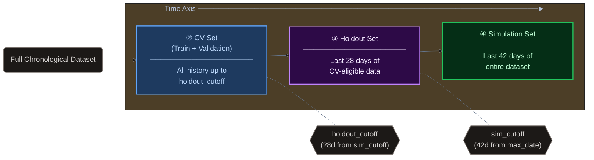
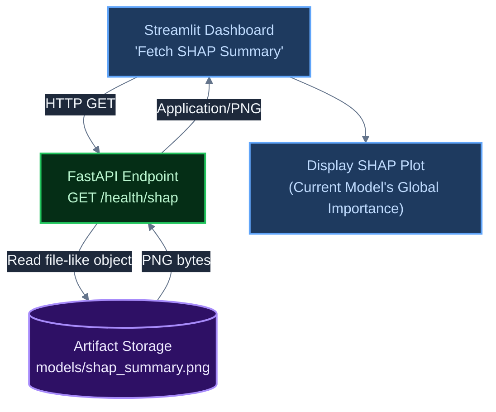

# ML Pipeline

**End-to-end walkthrough of the Rossmann forecasting model: from raw data to production predictions.**

---

## Table of Contents

1. [Dataset Overview](#1-dataset-overview)
2. [Data Validation](#2-data-validation)
3. [Feature Engineering](#3-feature-engineering)
4. [Modeling Strategy](#4-modeling-strategy)
5. [Evaluation Metrics](#5-evaluation-metrics)
6. [Experiment Tracking](#6-experiment-tracking)
7. [Model Explainability (SHAP)](#7-model-explainability-shap)
8. [Artifact Management](#8-artifact-management)

---

## 1. Dataset Overview

**Source**: Kaggle Rossmann Store Sales (managed via DVC, stored on DagsHub).

| File | Rows (approx.) | Key Columns |
| :--- | :--- | :--- |
| `data/raw/train.csv` | 1,017,209 | `Store`, `Date`, `Sales`, `Customers`, `Open`, `Promo`, `StateHoliday`, `SchoolHoliday` |
| `data/raw/store.csv` | 1,115 | `Store`, `StoreType`, `Assortment`, `CompetitionDistance`, `Promo2`, `PromoInterval` |

**Pre-training filtering** (in `train_model.py`, lines 55–66):
- Only rows where `Open == 1` AND `Sales > 0` are retained.
- Zero-sales days (store closures) are excluded because RMSPE is undefined when the true value is zero.

---

## 2. Data Validation

**Implementation**: `src/rossmann_ops/data_validation.py` — Pandera `DataFrameModel`.

Validation runs **before any feature engineering** in `train_model.py` (line 52: `df = validate_data(df)`). This is the first line of defense against data poisoning entering the training pipeline.

### Schema Contract

| Column | Expected Type | Constraint | Nullable |
| :--- | :--- | :--- | :--- |
| `Store` | `int` | ≥ 1 | No |
| `DayOfWeek` | `int` | 1–7 | No |
| `Sales` | `int` | ≥ 0 | No |
| `Customers` | `int` | ≥ 0 | Yes |
| `Open` | `int` | `∈ {0, 1}` | No |
| `Promo` | `int` | `∈ {0, 1}` | No |
| `StateHoliday` | `str` | — | Yes |
| `SchoolHoliday` | `int` | `∈ {0, 1}` | Yes |
| `StoreType` | `str` | — | Yes |
| `Assortment` | `str` | — | Yes |

**Config**: `strict=False` (extra columns from the `store.csv` merge are allowed), `coerce=True` (type coercion before validation).

**On failure**: raises `pa.errors.SchemaError` — halts training immediately, preventing corrupted data from producing a silently wrong model.

---

## 3. Feature Engineering

**Implementation**: `src/rossmann_ops/features.py`

Two functions with a strict separation of concerns:

| Function | Role |
| :--- | :--- |
| `build_features(df, train_comp_median, expected_ohe_cols)` | Stateless transforms applied identically at train and inference time |
| `apply_target_encoding(df, store_means, global_mean)` | Stateful: reads from a pre-computed artifact |

### 3.1 Stateless Transforms (`build_features`)

**Date decomposition** (`features.py`, lines 44–51):
```python
df["Year"]      = df["Date"].dt.year
df["Month"]     = df["Date"].dt.month
df["WeekOfYear"] = df["Date"].dt.isocalendar().week.astype(int)
df["DayOfWeek"] = df["Date"].dt.dayofweek + 1   # 1=Monday, 7=Sunday
```
DayOfWeek is standardized to the 1–7 business convention (not Python's 0–6 default).

**Categorical One-Hot Encoding** (`features.py`, lines 53–61):
`StoreType`, `Assortment`, and `StateHoliday` are passed to `pd.get_dummies`. The resulting columns follow the pattern `StoreType_a`, `Assortment_c`, `StateHoliday_0`, etc.

**Competition Distance — Log transform with median imputation** (`features.py`, lines 63–66):
```python
dist = pd.to_numeric(df["CompetitionDistance"], errors="coerce")
df["LogCompDist"] = np.log1p(dist.fillna(train_comp_median))
```
- Missing `CompetitionDistance` (rural stores with no recorded competitor) is filled with the **training-set median**, not the global mean. This prevents train-serve skew.
- `log1p` compresses the extreme right-skew of distance values (ranges from 20m to 75,860m in the training data).
- `train_comp_median` is computed once in `train_model.py` (line 77) and must be reused identically at inference. The API currently derives it from the enriched request row as a pragmatic fallback since `STORE_MEANS` already captures the store-level distance signal (see `api/main.py`, line 238).

**OHE Column Alignment — Inference guard** (`features.py`, lines 68–84):
```python
if expected_ohe_cols is not None:
    for col in expected_ohe_cols:
        if col not in df.columns:
            df[col] = 0          # fill missing OHE columns with 0 (not that category)
    # Drop any unexpected OHE columns
    extra = [c for c in df.columns if any(c.startswith(p) for p in
             ("StoreType_", "Assortment_", "StateHoliday_")) and c not in expected_ohe_cols]
    df.drop(columns=extra, inplace=False)
```
The **OHE column contract** is defined in `configs/params.yaml` (lines 14–25):
```yaml
features:
  ohe_expected_columns:
    - StoreType_a
    - StoreType_b
    - StoreType_c
    - StoreType_d
    - Assortment_a
    - Assortment_b
    - Assortment_c
    - StateHoliday_0
    - StateHoliday_a
    - StateHoliday_b
    - StateHoliday_c
```
This contract ensures that a single-store inference payload that only contains one `StoreType` value does not produce a 1-column OHE matrix — instead, all 11 OHE columns are always present, matching the training schema exactly.

### 3.2 Target Encoding — Store Mean Sales (`apply_target_encoding`)

**Implementation**: `features.py`, lines 90–118; artifact: `models/store_target_means.json`

**Training-time computation** (leak-free, `train_model.py`, lines 90–100):
```python
df_cv["Store_TargetMean"] = df_cv.groupby("Store")["Sales"].transform(
    lambda x: x.shift().expanding().mean()   # expanding mean of past values only
)
global_mean = float(df_cv["Sales"].mean())
df_cv["Store_TargetMean"].fillna(global_mean)  # handles first row per store

# Final per-store average — written to the inference artifact
final_store_means = df_cv.groupby("Store")["Sales"].mean().to_dict()
```
Uses an **expanding mean with a one-row shift** to prevent data leakage: when computing the target mean for a given `(store, date)` row, only all *prior* rows for that store are used — never the current value.

**Inference-time lookup** (`apply_target_encoding`, lines 112–113):
```python
df["Store_TargetMean"] = df["Store"].map(store_means).fillna(global_mean)
```
Unseen store IDs (new stores not in the training set) fall back to the global mean — preventing `NaN` from propagating to the model.

**Artifact**: `models/store_target_means.json` — JSON with two keys:
```json
{
  "store_means": {"1": 5263.72, "2": 4821.13, ...},
  "global_mean": 5773.82
}
```
JSON keys are strings (JSON limitation); the API converts them back to `int` on load (`api/main.py`, line 100).

### 3.3 Final Feature Set

The model receives the following 18 features, in this exact order:

| Feature | Type | Source |
| :--- | :--- | :--- |
| `DayOfWeek` | int (1–7) | Date extraction |
| `Promo` | int (0/1) | Raw |
| `Year` | int | Date extraction |
| `Month` | int (1–12) | Date extraction |
| `WeekOfYear` | int (1–53) | Date extraction |
| `LogCompDist` | float | Log-transformed CompetitionDistance |
| `Store_TargetMean` | float | `store_target_means.json` lookup |
| `StoreType_a` … `StoreType_d` | int (0/1) | OHE |
| `Assortment_a` … `Assortment_c` | int (0/1) | OHE |
| `StateHoliday_0` … `StateHoliday_c` | int (0/1) | OHE |

---

## 4. Modeling Strategy

### 4.1 Data Split

**Implementation**: `train_model.py`, lines 57–73

Strictly **chronological** — no random shuffling to avoid temporal leakage.



| Split | Duration | Purpose |
| :--- | :--- | :--- |
| **CV set** | All data before holdout period | Model training |
| **Holdout** | Last 28 days of CV-eligible data | Unbiased evaluation |
| **Simulation set** | Last 42 days of entire dataset | Never seen during training; used by `simulate_production.py` for drift detection |

Both the holdout and simulation cutoffs are computed from `configs/params.yaml`:
```yaml
data_split:
  simulation_days: 42
  holdout_days: 28
```

### 4.2 Target Transformation

The target `Sales` is modeled in **log-space** (`train_model.py`, line 117):
```python
y_cv_log = np.log1p(df_cv["Sales"])
```

**Why**: Raw sales values have a heavy right tail (range: 1 – 41,551). Log-transformation compresses this, making residuals more homoskedastic and reducing the impact of large-value outliers on the loss function.

**At inference**: predictions are restored to the original sales scale via:
```python
prediction = float(np.expm1(prediction_log[0]))  # api/main.py, line 271
```
The holdout evaluation (`train_model.py`, lines 165–173) also applies `np.expm1` before computing metrics, ensuring all reported metrics are in **actual EUR sales units** — not log-space.

### 4.3 Production Model — Random Forest

**Config** (`configs/params.yaml`, lines 32–39):
```yaml
model:
  type: "RandomForest"
  production:
    n_estimators: 50
    max_depth: 10
    min_samples_split: 6
  random_state: 105
```

**Training call** (`train_model.py`, lines 152–162):
```python
model = RandomForestRegressor(
    n_estimators=50,
    max_depth=10,
    min_samples_split=6,
    random_state=105,
    n_jobs=-1,        # uses all available CPU cores
)
model.fit(X_cv.astype(np.float64), y_cv_log)
```

The explicit `astype(np.float64)` cast ensures consistent MLflow schema logging and robustness to integer feature inputs at inference time.

<details>
<summary><strong>Why Random Forest over XGBoost?</strong></summary>

XGBoost was evaluated during hyperparameter search (see `notebooks/03_optuna.ipynb`). Random Forest was selected for the production model because:
- Comparable RMSPE on the holdout set in this feature regime.
- Native parallelism via `n_jobs=-1` without needing GPU or specialized builds.
- SHAP TreeExplainer is directly compatible with `sklearn` ensemble models.
- Simpler dependency footprint in production containers.

</details>

---

## 5. Evaluation Metrics

**Primary metric**: **RMSPE** (Root Mean Squared Percentage Error) — the official Kaggle competition metric.

$$\text{RMSPE} = \sqrt{\frac{1}{n} \sum_{i=1}^{n} \left(\frac{y_i - \hat{y}_i}{y_i}\right)^2}$$

**Implementation** (`train_model.py`, lines 27–32):
```python
def rmspe(y_true: np.ndarray, y_pred: np.ndarray) -> float:
    y_pred = np.maximum(y_pred, 1.0)    # floor predictions to avoid /0
    mask   = y_true != 0               # exclude zero-sales rows
    return float(np.sqrt(np.mean(((y_true[mask] - y_pred[mask]) / y_true[mask]) ** 2)))
```

**Key design choices**:
- Zero-sales rows are **excluded** from RMSPE computation (`mask = y_true != 0`). Including them would produce `inf` errors.
- Predictions are floored at 1.0 (`np.maximum(y_pred, 1.0)`) to prevent division-by-zero on near-zero predictions.

All four metrics are logged to MLflow automatically:

| Metric | Key | Description |
| :--- | :--- | :--- |
| RMSPE | `holdout_rmspe` | Primary competition metric (lower is better) |
| RMSE | `holdout_rmse` | EUR, sensitive to large errors |
| MAE | `holdout_mae` | EUR, robust to outliers |
| R² | `holdout_r2` | Variance explained (1.0 = perfect) |

---

## 6. Experiment Tracking

**Implementation**: `train_model.py`, lines 128–221 — MLflow integrated throughout.

**Tracking URI**: Defaults to DagsHub remote (`MLFLOW_TRACKING_URI` env var) with a local SQLite fallback:
```python
mlflow.set_tracking_uri(
    os.getenv("MLFLOW_TRACKING_URI", f"sqlite:///{project_root}/mlruns/mlflow.db")
)
```

**Logged artifacts**:
- **Parameters**: `model_type`, `n_estimators`, `max_depth`, `min_samples_split`, `random_state`, `holdout_days`, `simulation_days`, `n_cv_rows`, `train_comp_median`
- **Metrics**: `holdout_rmspe`, `holdout_rmse`, `holdout_mae`, `holdout_r2`
- **Artifacts**: `shap_summary.png` (global feature importance plot)
- **Model**: Logged via `mlflow.sklearn.log_model(model, name="production_model")` and also saved locally to `models/production_model/` (MLflow serialization format)

`mlflow.sklearn.autolog(log_models=False)` is also active, capturing sklearn-specific metadata automatically. `log_models=False` prevents autolog from saving a second copy of the model — the explicit `log_model` call is used instead for fine-grained control.

**View locally**:
```bash
just mlflow-ui
# → http://localhost:5000
```

---

## 7. Model Explainability (SHAP)

**Implementation**: `train_model.py`, lines 191–209

```python
explainer = shap.TreeExplainer(model)
sample_X  = X_cv.sample(min(500, len(X_cv)), random_state=105)
shap_values = explainer.shap_values(sample_X)

plt.figure(figsize=(10, 6))
shap.summary_plot(shap_values, sample_X, show=False)
plt.savefig("models/shap_summary.png")
```

SHAP values are computed on **a 500-row sample** from the CV set for speed. `TreeExplainer` uses the exact fast-path algorithm specific to tree ensembles (not the generic permutation approximation).

The resulting `shap_summary.png` is:
1. **Saved to** `models/shap_summary.png` (DVC-tracked artifact)
2. **Logged to** MLflow as a run artifact
3. **Served live** by the API at `GET /health/shap`
4. **Rendered in** the Streamlit dashboard via the "Model Diagnostics & Explainability" expander

**In the dashboard**:
```python
# ui/app.py, lines 188–198
if st.button("Fetch SHAP Summary"):
    r = requests.get(f"{api_url}/health/shap")
    if r.status_code == 200:
        st.image(r.content, use_container_width=True)
```

### SHAP Round-Trip Flow



This round-trip ensures the SHAP plot always corresponds to the **currently loaded model version**, not a stale cached image.

---

## 8. Artifact Management

All production artifacts are DVC-tracked and committed as `.dvc` pointer files:

| Artifact | Path | DVC File |
| :--- | :--- | :--- |
| Serialized model | `models/production_model/` | `models/production_model.dvc` |
| SHAP plot | `models/shap_summary.png` | `models/shap_summary.png.dvc` |
| Target means | `models/store_target_means.json` | `models/store_target_means.json.dvc` |

**Remote storage**: DagsHub (configured in `.dvc/config`).

**Pull artifacts locally**:
```bash
dvc pull          # or: just pull
```

### Artifact Pipeline Bridge

After training, model artifacts are uploaded as a **GitHub Actions Artifact** (`production-model`) and then **downloaded** in the subsequent `build-and-push` job, bridging the two jobs without requiring DVC push in CI.

```mermaid
%%{init: {"theme": "base", "themeVariables": {"background": "#0f172a", "primaryColor": "#1e293b", "primaryTextColor": "#f1f5f9", "primaryBorderColor": "#334155", "lineColor": "#64748b", "edgeLabelBackground": "#1e293b"}}}%%
flowchart LR
    classDef job fill:#1e3a5f,stroke:#60a5fa,color:#bfdbfe,stroke-width:2px
    classDef artifact fill:#052e16,stroke:#22c55e,color:#bbf7d0,stroke-width:2px
    classDef target fill:#0c2d48,stroke:#2e9cca,color:#d1e8e2,stroke-width:2px

    J1["① Train Model Job\n(Runner A)"]:::job
    AM["Artifact Store\n(GHA Temporary)"]:::artifact
    J2["② Build Image Job\n(Runner B)"]:::job
    Docker["Production Image\n(rossmann-api:latest)"]:::target

    J1 -->|"actions/upload-artifact@v4"| AM
    AM -->|"actions/download-artifact@v4"| J2
    J2 -->|"COPY models/ /app/models/"| Docker
```



```yaml
- name: Upload model artifact
  uses: actions/upload-artifact@v4
  with:
    name: production-model
    path: models/
    retention-days: 7
```
