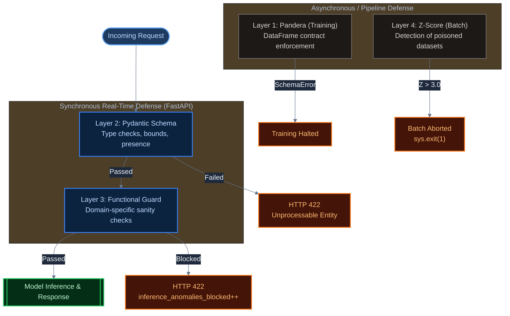
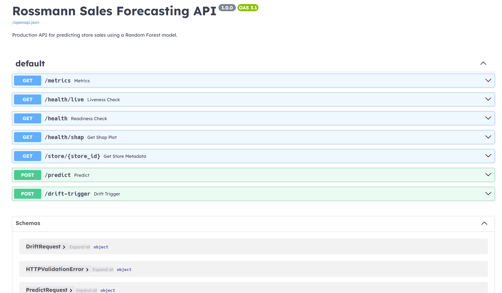
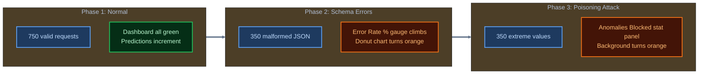
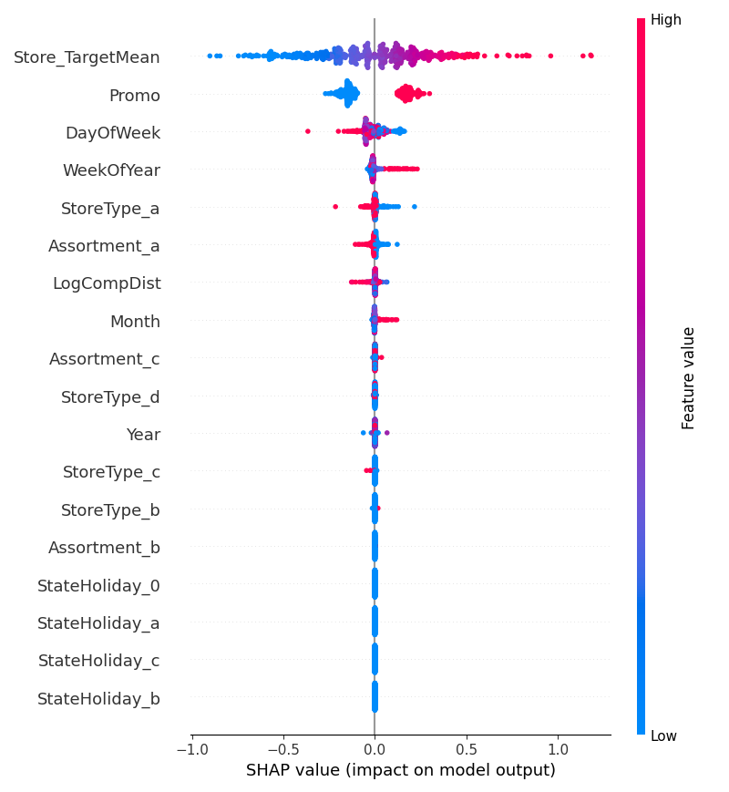

# Observability & Security

**Telemetry stack, defensive architecture, and drift detection mechanisms.**

---

## Table of Contents

- [Observability \& Security](#observability--security)
  - [Table of Contents](#table-of-contents)
  - [1. Security Architecture — Layered Defense](#1-security-architecture--layered-defense)
    - [Request Lifecycle \& Defense Layers](#request-lifecycle--defense-layers)
  - [2. Layer 1: Schema Validation (Pandera)](#2-layer-1-schema-validation-pandera)
    - [Schema Definition](#schema-definition)
  - [3. Layer 2: API Input Bounds (Pydantic)](#3-layer-2-api-input-bounds-pydantic)
  - [4. Layer 3: Functional Guard (Inference-time)](#4-layer-3-functional-guard-inference-time)
  - [5. Layer 4: Z-Score Batch Poisoning Detection](#5-layer-4-z-score-batch-poisoning-detection)
  - [6. Telemetry — Prometheus Metrics](#6-telemetry--prometheus-metrics)
    - [Auto-instrumented Metrics](#auto-instrumented-metrics)
    - [Custom Metrics](#custom-metrics)
  - [7. Grafana Dashboard](#7-grafana-dashboard)
    - [Panel Specifications](#panel-specifications)
  - [8. Drift Detection — KS-Test](#8-drift-detection--ks-test)
    - [Mechanics](#mechanics)
    - [KS Statistic Interpretation](#ks-statistic-interpretation)
  - [9. Continuous Training Trigger](#9-continuous-training-trigger)
    - [Demo Phase Sequences](#demo-phase-sequences)
    - [Phase 1: Normal Traffic (750 requests)](#phase-1-normal-traffic-750-requests)
    - [Phase 2: Schema Errors (350 requests)](#phase-2-schema-errors-350-requests)
    - [Phase 3: Poisoning Attack (350 requests)](#phase-3-poisoning-attack-350-requests)
    - [Manual Variants (`simulate_production.py --mode`)](#manual-variants-simulate_productionpy---mode)

---

## 1. Security Architecture — Layered Defense

The system implements **four independent defensive layers** against malicious or malformed inputs, operating at different stages of the request lifecycle:

### Request Lifecycle & Defense Layers



**Synchronous defenses** (Layers 2 & 3) block individual requests in real-time and generate observable signals in Prometheus.  
**Asynchronous/pipeline defenses** (Layers 1 & 4) protect batch data integrity before it can influence the model.

---

## 2. Layer 1: Schema Validation (Pandera)

**Implementation**: `src/rossmann_ops/data_validation.py`  
**Called at**: `train_model.py`, line 52 — before any feature engineering.

### Schema Definition

```python
class RossmannSchema(pa.DataFrameModel):
    Store:         Series[int]          = pa.Field(ge=1)
    DayOfWeek:     Series[int]          = pa.Field(ge=1, le=7)
    Sales:         Series[int]          = pa.Field(ge=0)       # no negative sales
    Customers:     Optional[Series[int]]= pa.Field(ge=0)       # no negative customers
    Open:          Series[int]          = pa.Field(isin=[0, 1])
    Promo:         Series[int]          = pa.Field(isin=[0, 1])
    StateHoliday:  Optional[Series[str]]= pa.Field(nullable=True)
    SchoolHoliday: Optional[Series[int]]= pa.Field(isin=[0, 1], nullable=True)
    StoreType:     Optional[Series[str]]= pa.Field(nullable=True)
    Assortment:    Optional[Series[str]]= pa.Field(nullable=True)

    class Config:
        strict = False   # extra columns (from store.csv merge) are allowed
        coerce = True    # type coercion before validation
```

**Protections**:
- `Sales >= 0`: Prevents injected negative sales values from distorting the model.
- `DayOfWeek in [1,7]`: Rejects impossible day encodings.
- `Open in {0, 1}`: Rejects multi-class open-status injections.
- `Store >= 1`: Rejects ID=0 or negative IDs that could poison target encoding.

**On failure**: `pa.errors.SchemaError` is raised (`data_validation.py`, line 56), caught by the training script, and logged. Training halts. A poisoned dataset cannot produce a silently wrong model.

---

## 3. Layer 2: API Input Bounds (Pydantic)

**Implementation**: `src/rossmann_ops/api/schemas.py`  
**Applied at**: Every `POST /predict` request.

```python
class PredictRequest(BaseModel):
    Store:               int           = Field(..., gt=0)
    DayOfWeek:           int           = Field(..., ge=1, le=7)
    Date:                date          = Field(...)
    Promo:               int           = Field(..., ge=0, le=1)
    StateHoliday:        str           = Field(...)            # validated by downstream OHE
    StoreType:           str           = Field(..., pattern="^[abcd]$")
    Assortment:          str           = Field(..., pattern="^[abc]$")
    CompetitionDistance: Optional[float] = Field(None, ge=0)
```

**Type coercion**: FastAPI + Pydantic v2 automatically handles JSON type coercion (e.g., `"1"` → `1` for integers). However, a completely wrong type (e.g., `"NOT_AN_INTEGER"` for `DayOfWeek`) is rejected immediately.

**Validation failures** produce `HTTP 422 Unprocessable Entity` with a structured error body detailing exactly which field failed and why. These 422 responses are automatically counted by the Prometheus instrumentation middleware and appear in the "Error Rate" and "HTTP Status Distribution" Grafana panels.

**Regex guards**:
- `StoreType: pattern="^[abcd]$"` — only accepts single lowercase letter a–d.
- `Assortment: pattern="^[abc]$"` — only accepts single lowercase letter a–c.

These prevent injections of arbitrary string values that could create unexpected OHE columns and break the feature contract.

**`CompetitionDistance` is `Optional[float]`** — `None` triggers an automatic lookup from `store.csv` at inference time. This accommodates rural stores with no recorded competitor without requiring the caller to guess a value.

### Interactive API Documentation (Swagger)



---

## 4. Layer 3: Functional Guard (Inference-time)

**Implementation**: `src/rossmann_ops/api/main.py`, lines 204–219  
**Applied at**: Inside `predict()`, after Pydantic validation passes.

```python
# api/main.py, lines 204-219
if (
    request.CompetitionDistance is not None
    and request.CompetitionDistance > 100_000
):
    INFERENCE_ANOMALIES_BLOCKED.inc()
    logger.warning(
        "Anomalous CompetitionDistance=%.2f blocked for Store=%d.",
        request.CompetitionDistance,
        request.Store,
    )
    raise HTTPException(
        status_code=422,
        detail="CompetitionDistance exceeds plausible range (>100 000 m). Request blocked.",
    )
```

**Why this exists alongside Pydantic**: The Pydantic schema (`schemas.py`, line 36) defines `CompetitionDistance: Optional[float] = Field(None, ge=0)` — a lower bound of 0, but **no upper bound**. This is intentional: rural stores with very large but legitimate competitor distances must be accepted. The maximum recorded value in the training dataset is ~75,860m. The 100,000m threshold was chosen to reject geometrically absurd values (>100km) while accommodating realistic edge cases.

**Observable signal**: Every blocked request increments `inference_anomalies_blocked_total`, the custom Prometheus counter defined at:
```python
# api/main.py, lines 72-75
INFERENCE_ANOMALIES_BLOCKED = Counter(
    "inference_anomalies_blocked",
    "Total prediction requests blocked due to anomalous/poisoned input.",
)
```

This counter is visualized in the Grafana "Anomalies Blocked" stat panel.

---

## 5. Layer 4: Z-Score Batch Poisoning Detection

**Implementation**: `scripts/simulate_production.py`, function `simulate_attack()`, lines 116–139  
**Applied at**: Pre-ingestion of batch data in the simulation pipeline.

```python
def simulate_attack():
    # Inject astronomically high Sales values into a batch
    malicious_batch = y_test.copy().values
    malicious_batch[0:10] = 999_999_999   # 10 poisoned rows

    # Compute Z-scores on the entire batch
    mean_val = np.mean(malicious_batch)
    std_val  = np.std(malicious_batch)
    z_scores = (malicious_batch - mean_val) / std_val
    max_z    = np.max(z_scores)

    if max_z > Z_SCORE_THRESHOLD:   # threshold: 3.0 (from configs/params.yaml)
        logger.error(f"Anomaly/Poisoning detected! Z-Score {max_z:.2f} exceeds threshold.")
        sys.exit(1)                  # non-zero exit → CI job marks as "detected"
```

**Threshold**: `z_score_threshold: 3.0` (`configs/params.yaml`, line 47). This is the standard statistical threshold for outlier detection — a value 3 standard deviations from the mean is present in ~0.27% of a normal distribution.

**In CI**: The `simulate` job marks `continue-on-error: true` for `attack` mode because `sys.exit(1)` is the **expected success state** — it proves the detection logic fired. Without `continue-on-error`, CI would incorrectly report the job as failed.

---

## 6. Telemetry — Prometheus Metrics

**Instrumentation library**: `prometheus-fastapi-instrumentator` v7.1.0+  
**Initialization** (`api/main.py`, lines 40–58):

```python
Instrumentator().instrument(
    app,
    latency_highr_buckets=(
        0.005, 0.01, 0.025, 0.05, 0.075, 0.1,
        0.25, 0.5, 0.75, 1.0, 2.5, 5.0, 7.5, 10.0,
    ),
).expose(app)
```

`latency_highr_buckets` configures the histogram bucket boundaries for `http_request_duration_seconds`. Custom sub-100ms granularity (5ms, 10ms, 25ms, 50ms, 75ms, 100ms) enables accurate p95/p50 quantile computation for fast inference responses — the "bucket blindness" that would occur with default buckets (which start at 250ms) is avoided.

### Auto-instrumented Metrics

| Metric                          | Type      | Labels                        |
| :------------------------------ | :-------- | :---------------------------- |
| `http_requests_total`           | Counter   | `method`, `handler`, `status` |
| `http_request_duration_seconds` | Histogram | `method`, `handler`           |

### Custom Metrics

| Metric                              | Type    | Description                   | Defined                |
| :---------------------------------- | :------ | :---------------------------- | :--------------------- |
| `sales_inference_total`             | Counter | Successful predictions served | `api/main.py`, line 68 |
| `inference_anomalies_blocked_total` | Counter | Poisoned requests blocked     | `api/main.py`, line 72 |

**`sales_inference_total` incremented at** (`api/main.py`, line 273):
```python
SALES_INFERENCE_TOTAL.inc()
return {"Store": ..., "PredictedSales": prediction, ...}
```
Incremented only after a **successful prediction** — not on errors — providing an accurate count of served forecasts.

**Metrics endpoint**: `GET /metrics` (exposed automatically by `.expose(app)`, Prometheus scrapes this).

---

## 7. Grafana Dashboard

**Deployment**: ConfigMap (`k8s/grafana-dashboard.yaml`), dashboard ID `rossmann-perf`.  
**Access**: `http://localhost:30200` (credentials: `admin / prom-operator`)  
**Auto-refresh**: 1s (dashboard `"refresh": "1s"`)  
**Default time window**: Last 15 minutes (`"time": {"from": "now-15m", "to": "now"}`)

### Panel Specifications

<details>
<summary><strong>Global RPS (1m)</strong> — Stat panel (top-left)</summary>

```promql
sum(irate(http_requests_total[1m]))
```
- Type: `stat` with area graph
- Color: fixed green, turns red at 100 req/s
- Unit: `reqps`

Uses `irate` (instantaneous derivative) not `rate` (average over window) — gives per-scrape-interval sensitivity (1s), making burst spikes immediately visible rather than smoothed over the rate window.

</details>

<details>
<summary><strong>Error Rate % (5m)</strong> — Gauge panel (top, second)</summary>

```promql
sum(rate(http_requests_total{status=~"4..|5.."}[5m])) / sum(rate(http_requests_total[5m])) * 100
```
- Type: `gauge`
- Thresholds: < 5% green, 5–20% yellow, > 20% red
- Unit: `percent`

Counts both 4xx (client errors, including 422 schema blocks) and 5xx (server errors) in the numerator. During the observability demo Phase 2 and Phase 3, this gauge will climb into the yellow/red zones.

</details>

<details>
<summary><strong>Total Predictions Served</strong> — Stat panel (top, third)</summary>

```promql
sum(sales_inference_total)
```
- Type: `stat`
- Color: fixed blue
- Unit: integer (no decimals)

Cumulative count across all replicas. Sums across pods — the `sum()` aggregation is critical because each pod maintains its own counter independently.

</details>

<details>
<summary><strong>Anomalies Blocked</strong> — Stat panel (top-right)</summary>

```promql
sum(inference_anomalies_blocked_total)
```
- Type: `stat` with background color mode
- Thresholds: 0 = green background, ≥ 1 = orange background

Immediately highlights any poisoning attempt. The color change from green → orange provides a clear visual signal during the demo.

</details>

<details>
<summary><strong>p95 / p50 Latency (5m)</strong> — Time series (middle-left)</summary>

```promql
# p95
histogram_quantile(0.95, sum by (le) (rate(http_request_duration_seconds_bucket[5m])))

# p50 (median)
histogram_quantile(0.50, sum by (le) (rate(http_request_duration_seconds_bucket[5m])))
```
- Type: `timeseries`
- Both quantiles plotted simultaneously; legend shows mean + max
- Red threshold line at 0.5s
- Smooth line interpolation, 10% fill opacity

</details>

<details>
<summary><strong>HTTP Status Distribution (5m)</strong> — Donut chart (middle-right)</summary>

```promql
sum by (status) (rate(http_requests_total[5m]))
```
- Type: `piechart` (donut mode)
- Color overrides: 4xx → orange, 5xx → red, 2xx → default green
- Legend in table mode (right placement)

During normal operation, this will be nearly entirely 2xx. During Phase 2/3 of the observability demo, 422 slices become clearly visible.

</details>

---

## 8. Drift Detection — KS-Test

**Implementation**: `scripts/simulate_production.py`, function `simulate_drift()`, lines 166–187

### Mechanics

The **Kolmogorov-Smirnov two-sample test** (`scipy.stats.ks_2samp`) measures whether two samples were drawn from the same underlying distribution. It is non-parametric — no distribution assumption is made.

```python
def simulate_drift():
    X_test, _ = get_test_data()

    # Baseline: real CompetitionDistance values from the simulation set
    baseline_feature  = X_test[DRIFT_FEATURE].fillna(0).values

    # Shifted: simulated production data with introduced distributional shift
    shifted_feature = baseline_feature + DRIFT_SHIFT   # +50,000m shift (from params.yaml)

    stat, p_value = stats.ks_2samp(baseline_feature, shifted_feature)

    if p_value < P_VALUE_THRESHOLD:   # 0.05 (from params.yaml)
        trigger_github_workflow()
```

**Parameters** (all in `configs/params.yaml`, lines 46–50):
```yaml
pipeline:
  simulation:
    z_score_threshold: 3.0
    p_value_threshold: 0.05
    drift_feature: "CompetitionDistance"
    drift_shift: 50000.0
```

**Drift feature**: `CompetitionDistance` is the monitored feature. A 50,000m shift is applied to simulate a scenario where incoming data's competitor distance distribution has significantly changed from the training distribution (e.g., mass market changes, new competitor dataset, geographical relocation of stores).

### KS Statistic Interpretation

The KS statistic $D$ is the maximum absolute difference between the empirical CDFs of the two distributions:
$$D = \sup_x |F_1(x) - F_2(x)|$$

A high $D$ value (→ 1.0) and low p-value (→ 0) indicates the distributions are significantly different. At `drift_shift = 50,000`, the two distributions are completely non-overlapping → KS statistic will be 1.0 and p-value effectively 0.

---

## 9. Continuous Training Trigger

**Implementation**: `scripts/simulate_production.py`, function `trigger_github_workflow()`, lines 142–163

```python
def trigger_github_workflow():
    url = f"https://api.github.com/repos/{REPO_OWNER}/{REPO_NAME}/dispatches"
    headers = {
        "Accept": "application/vnd.github.v3+json",
        "Authorization": f"token {GITHUB_PAT}",
    }
    payload = {"event_type": "drift_detected"}
    res = requests.post(url, headers=headers, json=payload)
    # Success: HTTP 204 No Content
```

**Required environment variable**: `GITHUB_PAT` — a GitHub Personal Access Token with `repo` scope. Without it, drift is logged but no retraining is triggered.

**Receiving side** (`.github/workflows/mlops_pipeline.yaml`, lines 9–10):
```yaml
on:
  repository_dispatch:
    types: [drift_detected]
```

When this event is received, GitHub Actions runs the full CI → Train → Build → Push pipeline, producing a new model artifact that reflects the shifted data distribution.

---

**Run**:
```bash
just demo
```

### Demo Phase Sequences



### Demo Observations (Grafana)


### Phase 1: Normal Traffic (750 requests)
- Sends valid prediction requests with randomized store IDs (1–1000).
- **Observe**: "Global RPS" climbs, "Total Predictions" increments steadily. Dashboard stays green.

### Phase 2: Schema Errors (350 requests)
- Sends `{"Store": "INVALID_TYPE", "Missing": "Fields"}` — wrong types, missing required fields.
- FastAPI/Pydantic rejects each request with `HTTP 422 Unprocessable Entity`.
- **Observe**: "Error Rate %" gauge climbs into yellow. Donut chart shows 4xx slice growing orange. "Anomalies Blocked" stays at 0 (these are schema errors, not poisoning attempts).

### Phase 3: Poisoning Attack (350 requests)
- Sends `CompetitionDistance: 999999.0` — geometrically impossible value (>100km).
- Both Pydantic (`ge=0` passes) and the functional guard (`> 100,000`) evaluate. The guard blocks each request and increments `inference_anomalies_blocked_total`.
- **Observe**: "Anomalies Blocked" increments. "Error Rate %" stays elevated. Dashboard background turns orange for the blocked counter.

### Manual Variants (`simulate_production.py --mode`)

| Mode     | What Happens                                                                                        |
| :------- | :-------------------------------------------------------------------------------------------------- |
| `schema` | Single malformed JSON request; logs the 422 response with details                                   |
| `attack` | Generates a batch with 10 poisoned rows (Sales=999,999,999); Z-score check fires; exits with code 1 |
| `drift`  | KS-Test on CompetitionDistance; fires repository_dispatch if p < 0.05                               |

---

## 11. Model Interpretability (SHAP)

**Implementation**: `train_model.py`, lines 191–209  
**Artifact**: `models/shap_summary.png`

The system uses **SHAP (SHapley Additive exPlanations)** to provide globally interpretable insights into model behavior. A `TreeExplainer` is trained on a representative sample of the training data, producing a summary plot that ranks features by their impact on forecasted sales.

### Global Feature Importance



**Key Insights**:
- **`Store_TargetMean`**: Dominant predictor; captures individual store potential.
- **`Promo`**: Strongest dynamic catalyst for sales spikes.
- **`DayOfWeek`**: Captures weekly cyclical patterns (e.g., Saturday surges).
