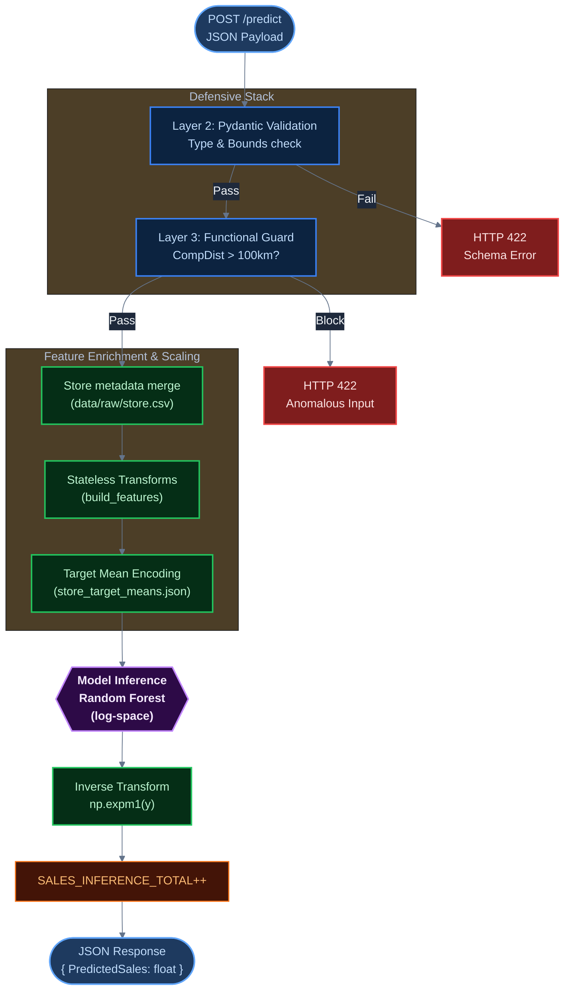

# Team Cheat Sheet

**Anticipated Q&A mapped directly to source code and implementation details.**

---

## How to Use This Document

Each entry follows:
- **Q**: Exact or paraphrased question likely to be asked
- **A**: Precise technical answer with file path + line number references
- **Demo**: How to show it live or in a screenshot

---

## Section 1: Data & Feature Engineering

---

**Q: How do you handle missing `CompetitionDistance` values in production?**

**A**: `CompetitionDistance` is optional in the API schema (`schemas.py`, line 36: `Optional[float] = Field(None, ge=0)`). When `None`, the API merges the request row against `store.csv` (`api/main.py`, lines 226–233) and uses the store's recorded value. If both are missing (truly unknown), `build_features()` fills it with the training-set median before log-transforming (`features.py`, line 66: `dist.fillna(train_comp_median)`). This prevents the `NaN → log1p(NaN) = NaN` failure path that would corrupt the inference feature vector.

**Demo**: Call `GET /store/{store_id}` with a real store ID — returns CompetitionDistance from metadata.

---

**Q: How do you prevent data leakage in your feature engineering?**

**A**: Two mechanisms:
1. **Target encoding** uses an **expanding mean with a 1-row shift** (`train_model.py`, lines 92–93): `x.shift().expanding().mean()`. This means at row $t$, only rows $\{0, 1, ..., t-1\}$ contribute. The current row's sales value never informs its own encoding.
2. **Train/holdout split is strictly chronological** (`train_model.py`, lines 57–73). No random shuffling. The holdout set (last 28 days) is never seen during training. The simulation set (last 42 days) is never seen during either training or evaluation.

---

**Q: Why did you use `log1p` transformation on the target?**

**A**: Raw sales values are right-skewed (range: 1–41,551 EUR). Log transformation compresses this, making the residual distribution more homoskedastic — which is an assumption of many loss functions and benefits tree model split quality. `np.log1p` is used instead of `np.log` to handle any edge-case zeros (though zero-sales rows are pre-filtered). Predictions are restored to the original scale via `np.expm1` at inference time (`api/main.py`, line 271). All reported metrics are computed in the original EUR space, not log-space (`train_model.py`, lines 167–168: `preds_log` → `preds = np.expm1(preds_log)`).

---

**Q: What is OHE column alignment and why does it matter?**

**A**: At training time, `pd.get_dummies` produces all categories present in the training data (e.g., all 4 store types → 4 columns). At inference, a single request row has only one store type — `pd.get_dummies` on that row produces only 1 OHE column. Without alignment, the model would receive a feature vector with the wrong number of columns and fail. The `expected_ohe_cols` contract in `configs/params.yaml` (lines 14–25) and the alignment logic in `build_features()` (`features.py`, lines 68–84) ensure all 11 OHE columns are always present, with missing ones filled as 0.

---

**Q: How do you ensure the same feature transformations are applied at training and inference?**

**A**: The shared `build_features(df, train_comp_median, expected_ohe_cols)` function in `src/rossmann_ops/features.py` is called identically during both training (`train_model.py`, lines 83–88) and at inference (`api/main.py`, lines 245–249). The `train_comp_median` is the only stateful parameter — it is computed once from the training set and stored in the target means artifact for reuse. The OHE contract (`ohe_expected_columns` in `params.yaml`) acts as the schema contract between training and serving.

---

## Section 2: Modeling

---

**Q: What model did you use? Why not XGBoost?**

**A**: Production model is a **Random Forest Regressor** (`sklearn.ensemble.RandomForestRegressor`). XGBoost was evaluated during Optuna hyperparameter search (`notebooks/03_optuna.ipynb`). Random Forest was selected because it delivered comparable RMSPE on the holdout set with: (a) native parallelism via `n_jobs=-1` without GPU/specialized builds; (b) direct compatibility with SHAP's `TreeExplainer` fast path; (c) simpler production dependency footprint. Hyperparameters: `n_estimators=50`, `max_depth=10`, `min_samples_split=6`, `random_state=105` (defined in `configs/params.yaml`, lines 36–39).

---

**Q: What metric did you use to evaluate the model and why?**

**A**: **RMSPE** (Root Mean Squared Percentage Error) — the official Kaggle Rossmann competition metric. It penalizes large percentage errors more than absolute errors, which is appropriate for sales forecasting where a 20% error on a high-volume store is more costly than a 20% error on a low-volume store. Implementation at `train_model.py`, lines 27–32. Zero-sales rows are excluded from computation (`mask = y_true != 0`) because RMSPE is undefined for true=0. All metrics are logged to MLflow: `holdout_rmspe`, `holdout_rmse`, `holdout_mae`, `holdout_r2`.

---

**Q: How large is your holdout set?**

**A**: 28 calendar days (`configs/params.yaml`, line 8: `holdout_days: 28`). The dataset spans 2013–2015. The last 28 days of training-eligible data form the holdout; the last 42 days are the simulation set excluded from all training and evaluation. Exact sizes are logged to MLflow on each run (`train_model.py`, line 71: `"n_cv_rows": len(X_cv)`).

---

**Q: How do you track experiments?**

**A**: MLflow with local SQLite tracking (`mlruns/mlflow.db`). Both `mlflow.sklearn.autolog()` (sklearn-specific metadata) and explicit `mlflow.log_params()` / `mlflow.log_metrics()` calls are used (`train_model.py`, lines 128–221). Each training run logs 8 parameters and 4 metrics, plus the SHAP plot artifact and the serialized model.

**Demo**: Run `just mlflow-ui` to view the local experiment dashboard with all historical runs and model artifacts.

---

## Section 3: API & Serving

---

**Q: How does the API load the model?**

**A**: The API first checks for `MLFLOW_MODEL_URI` + `MLFLOW_TRACKING_URI` environment variables. If both are set, it loads from the MLflow registry (`api/main.py`, lines 112–122). If that fails or vars are unset, it falls back to the local filesystem path `models/production_model/` (`api/main.py`, lines 124–130). This allows the same Docker image to work with either a live remote registry or a baked-in local model.

**Demo**: `GET /health` returns `"model_loaded": true` + `model_version` when the model is successfully loaded.

---

**Q: What are the API endpoints?**

| Endpoint            | Method | Purpose                                                                               |
| :------------------ | :----- | :------------------------------------------------------------------------------------ |
| `/predict`          | `POST` | Main inference endpoint. Returns `PredictedSales` as a float in original EUR scale.   |
| `/health`           | `GET`  | Readiness check. Returns `503` if model/data not loaded. Used by K8s Readiness Probe. |
| `/health/live`      | `GET`  | Liveness check. Always `200` if the process is running. Used by K8s Liveness Probe.   |
| `/health/shap`      | `GET`  | Serves `models/shap_summary.png` for UI rendering. Returns `404` if not found.        |
| `/store/{store_id}` | `GET`  | Returns store metadata (StoreType, Assortment, CompetitionDistance) for UI pre-fill.  |
| `/drift-trigger`    | `POST` | Stub endpoint for monitoring integration. Logs event, returns drift status.           |
| `/metrics`          | `GET`  | Prometheus scrape endpoint (auto-exposed by instrumentator).                          |
| `/docs`             | `GET`  | Auto-generated Swagger/OpenAPI documentation.                                         |

---

**Q: Walk me through what happens when I POST to `/predict`.**

**A**:
1. **Pydantic validation** (`schemas.py`): Type checks, field presence, value bounds. Returns `422` on failure.
2. **Functional guard** (`api/main.py`, lines 204–219): `CompetitionDistance > 100,000m` → blocks, increments `inference_anomalies_blocked_total`, returns `422`.
3. **DataFrame reconstruction**: Request is converted to a single-row DataFrame.
4. **Store metadata enrichment** (`api/main.py`, lines 226–233): Merges with `STORE_DF` to fill missing CompetitionDistance from `store.csv`.
5. **Feature transforms** (`build_features`): Date extraction, OHE, log-transform CompDist, OHE alignment.
6. **Target encoding** (`apply_target_encoding`): Adds `Store_TargetMean` from the pre-loaded artifact.
7. **Column alignment**: Ensures all 18 model features are present in the correct order.
8. **Inference**: `MODEL.predict(X)` returns a log-space value.
9. **Inverse transform**: `np.expm1(prediction_log[0])` restores to EUR scale.
10. **Counter**: `SALES_INFERENCE_TOTAL.inc()`.
11. **Response**: `{"Store": ..., "Date": ..., "PredictedSales": ..., "ModelVersion": ...}`.

---

`CompetitionDistance` is optional — omit it and the API fills it from `store.csv`.

### Inference Request Lifecycle



---

## Section 4: Security & Robustness

---

**Q: How do you defend against data poisoning?**

**A**: Four independent layers:
1. **Pandera** (`data_validation.py`): Validates training data schema before any feature engineering. Negative sales, impossible day numbers, invalid open-status values → `SchemaError` → training halted.
2. **Pydantic** (`schemas.py`): Validates every API request. Wrong types, missing required fields, values outside bounds → `HTTP 422`, request rejected in <1ms.
3. **Functional guard** (`api/main.py`, lines 204–219): Explicitly blocks `CompetitionDistance > 100,000m` — a geometrically impossible value used as a poisoning attack vector. Increments `inference_anomalies_blocked_total` counter.
4. **Distribution Defense**: For live production, Z-Score batch detection or KS-Test drift detection triggers automated retraining.
    - **Demo**: Use `just demo` (Phase 3). It sends a batch of extreme values that trigger Layer 3 guards and create visible spikes in the "Anomalies Blocked" Grafana panel.

---

**Q: What happens if the model artifacts are not loaded at startup?**

**A**: The API application still starts (does not crash). However:
- `GET /health` returns `HTTP 503` with `"status": "degraded"` and per-artifact flags (`model_loaded: false`, etc.).
- `POST /predict` returns `HTTP 503` with `"Model or target means not loaded"`.
- K8s Readiness Probe (`/health`) receives `503` → pod is **excluded from the Service endpoint pool** → no traffic is routed to the unready pod.
- Only when all three artifacts (model, store data, target means) are loaded does `/health` return `200` → pod is added back to rotation.

---

**Q: How do you ensure `StoreType` and `Assortment` can only be valid values?**

**A**: Pydantic regex patterns in `schemas.py`:
```python
StoreType:  str = Field(..., pattern="^[abcd]$")   # only a, b, c, d
Assortment: str = Field(..., pattern="^[abc]$")    # only a, b, c
```
Any other value returns `422` immediately. This prevents novel OHE categories from being injected at inference that would break the model's feature contract.

---

## Section 5: Kubernetes & Infrastructure

---

**Q: Why did you choose `RollingUpdate` over `Recreate` for the deployment strategy?**

**A**: The inference API is **fully stateless** — each pod independently loads the same model artifact, and any replica can serve any request without coordination. `RollingUpdate` with `maxUnavailable: 0` guarantees **zero-downtime updates**: old pods are only terminated after the new pod's readiness probe confirms it is healthy and serving. `Recreate` would cause complete downtime during updates and is appropriate only for stateful services requiring exclusive resource access (e.g., single-process database migrations). Both `api.yaml` (line 11) and `ui.yaml` (line 11) explicitly declare this strategy.

---

**Q: How does the Streamlit UI communicate with the API inside Kubernetes?**

**A**: Via Kubernetes internal DNS. The UI deployment sets `API_URL=http://api-service:8000` (`k8s/ui.yaml`, line 33). `api-service` is the name of the K8s Service object defined in `k8s/api.yaml`. Kubernetes resolves this hostname to the Service's ClusterIP, which load-balances across all healthy API pod replicas. This is more robust than `localhost` (which would only reach the same pod) or `NodePort` (which adds a network hop through the host machine).

---

**Q: What resources are allocated to each container?**

| Container      | CPU Request | CPU Limit | Memory Request | Memory Limit |
| :------------- | :---------- | :-------- | :------------- | :----------- |
| `rossmann-api` | 100m        | 500m      | 256Mi          | 512Mi        |
| `rossmann-ui`  | 100m        | 500m      | 256Mi          | 512Mi        |

Requests define the guaranteed allocation for scheduling; limits cap total consumption. Both containers are identical — appropriate since both perform lightweight I/O-bound work (the model inference itself is CPU-bound but fast for a 50-tree RF predicting a single row).

---

**Q: How do you check cluster status?**

```bash
just k8s-status
# equivalent: kubectl get pods,services,servicemonitors -A
```

---

## Section 6: CI/CD & Continuous Training

---

**Q: What triggers the CI/CD pipeline?**

**A**: Multiple triggers (`.github/workflows/mlops_pipeline.yaml`, lines 3–18):
- **Push to any branch**: CI only (lint + test).
- **Push to `main`** or any version tag: CI → Train → Build & Push Docker images.
- **Version tag (`v*.*.*`)**: CI → Train → Build & Push → **GitHub Release** (with deployment bundle ZIP and versioned K8s manifests).
- **`repository_dispatch` (event: `drift_detected`)**: Full CI → Train → Build & Push. Triggered by the monitoring layer or manual dispatch when feature/prediction drift exceeds thresholds.
- **`workflow_dispatch` (manual)**: CI + Optional Deployment verification.

---

**Q: How does the pipeline get training data in CI — there's no data in the repo?**

**A**: Data is fetched from DagsHub via DVC pull (`mlops_pipeline.yaml`, line 85: `uv run dvc pull -r dagshub`). DVC credentials are set at runtime using GitHub Secrets (lines 78–82):
```yaml
uv run dvc remote modify dagshub --local auth basic
uv run dvc remote modify dagshub --local user ${{ secrets.DAGSHUB_USERNAME }}
uv run dvc remote modify dagshub --local password ${{ secrets.DAGSHUB_PAT }}
```
The `--local` flag writes credentials to `.dvc/config.local` (not tracked by Git) — credentials never touch the repository.

---

**Q: How are Docker images tagged?**

**A**: On version tag pushes (`refs/tags/v*.*.*`), images receive both the semantic version tag AND `latest`:
```
user/rossmann-api:v1.2.3
user/rossmann-api:latest
```
On `main` branch pushes (no tag), only `latest` is updated. This enables **immutable version pinning**: a grader can deploy `v1.2.3` exactly, and that image will never change regardless of future `latest` updates.

---

**Q: How does continuous training work end-to-end?**

**A**:
1. Feature/Prediction drift is monitored (conceptualized in `scripts/simulate_production.py`).
2. KS-Test is performed: baseline distributions vs. incoming production data.
3. If drift is detected (p-value < 0.05), a `repository_dispatch` is fired to GitHub Actions.
4. GitHub Actions runs the full pipeline: CI → Train → Build → Push.
5. A new Docker image with the retrained model is published and deployed via `RollingUpdate`.

**Demo**: Since we lack a live incoming stream for the grader demo, we use `just demo`. This script simulates three phases of traffic against the cluster, creating the baseline for monitoring and then triggering the defensive "Blocked" spikes in Grafana, demonstrating the system acts on anomalous data.

---

**Q: Where are API tests? What do they test?**

**A**: `tests/test_api.py`. Tests use `TestClient` with mocked model artifacts (deterministic mock objects). Key test cases:
- `test_health_endpoint_with_model`: Asserts `GET /health` returns `200` + `model_loaded: true`.
- `test_predict_valid_payload`: Asserts `POST /predict` returns `200` + `PredictedSales` as a float.
- `test_predict_missing_required_fields`: Asserts missing required fields → `422`.
- `test_predict_invalid_store_type`: Asserts invalid `StoreType` (e.g., `"z"`) → `422`.
- `test_predict_invalid_competition_distance`: Asserts `CompetitionDistance > 100,000m` → `422`.
- API latency test: Asserts p99 latency on 50 consecutive requests stays under a threshold.

Run: `just test` or `uv run pytest tests/ -v`.

---

## Section 7: Explainability & Interpretability

---

**Q: How do you explain your model's predictions?**

**A**: SHAP (SHapley Additive exPlanations) via `shap.TreeExplainer` (`train_model.py`, lines 191–209). The TreeExplainer uses an algorithm specific to tree ensembles — exact and orders of magnitude faster than the generic permutation-based approach. SHAP values are computed on a 500-row sample of the training set. The global summary plot (`models/shap_summary.png`) shows:
- Each feature on the Y-axis, ordered by mean absolute SHAP value (importance).
- Each point is one training sample, coloured by feature value (red = high, blue = low).
- X-axis shows impact on model output (log-space sales prediction).

**Demo**: In the Streamlit dashboard, open "Model Diagnostics & Explainability (SHAP)" → click "Fetch SHAP Summary". The UI calls `GET /health/shap`, receives the PNG directly, and renders it in-browser.

---

**Q: What feature was most important to the model?**

**A**: Based on the SHAP analysis, `Store_TargetMean` (the per-store mean sales target encoding) is typically the dominant feature — it captures each store's baseline sales level. `Promo` is the second most important, and `DayOfWeek` captures the weekly sales cycle. This is interpretable: a store's historical average is the strongest predictor of tomorrow's sales, promotions significantly lift sales, and day-of-week captures regular shopping patterns.

---

## Section 8: Reproducibility

---

**Q: How do you ensure reproducibility?**

**A**: Several mechanisms:
- `uv.lock` pins all direct and transitive Python dependencies to exact versions (`python requires-python = "~=3.12.0"`).
- `random_state=105` is fixed in `configs/params.yaml` and passed to both `RandomForestRegressor` and `sample()` calls in training.
- DVC pins data artifacts by content hash (SHA256 in `.dvc` files) — `dvc pull` always retrieves the exact same data.
- Docker images built from the same `Dockerfile.api/ui` + `uv.lock` + model artifacts are byte-for-byte identical.
- GitHub Actions uses `uv sync --frozen` — refuses to proceed if `uv.lock` is out of sync with `pyproject.toml`.

---

**Q: How does a grader deploy and test the system from scratch?**

**A**: Three primary options, ordered by complexity:
1. **Option A: Local Development** (Fastest): `just setup` → `just train-prod` → `just serve-api` / `just serve-ui`. Runs directly on host machine.
2. **Option B: Docker Compose**: `just docker-up`. Pulls pre-built images from DockerHub and runs the stack in containers without K8s.
3. **Option C: Full K8s Production** (**Recommended**): `just deploy-all`. Trains, builds, and deploys to a local KinD cluster with Prometheus/Grafana monitors as a complete MLOps environment.

**Prerequisites**: `just` and `uv` (global), Docker Desktop, Helm (for K8s path).
## Section 9: Simulation Scripts vs. Observability Demo

- **`simulate_production.py`**: A conceptual script implementing KS-Test drift detection and Z-Score poisoning logic. It is intended for architecture reference and CI/CD integration.
- **`observability_demo.py` (`just demo`)**: The primary tool for live demonstration. It hits the production endpoints (K8s or Docker) sequentially with Normal, Malformed, and Attack traffic.
- **Why use `just demo`?** In a local grader environment, we cannot wait for natural drift. `just demo` creates instant metric spikes in Grafana, proving the Prometheus instrumentation and defensive guards are functional.
